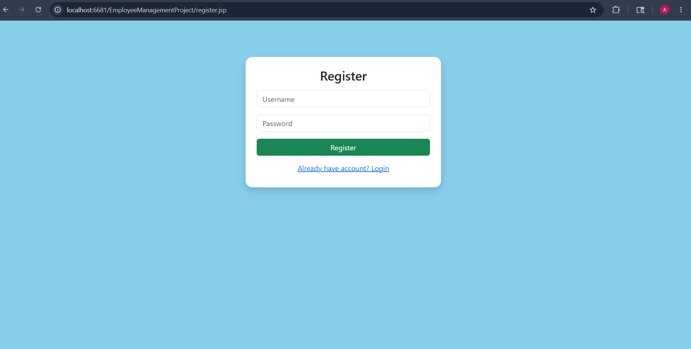
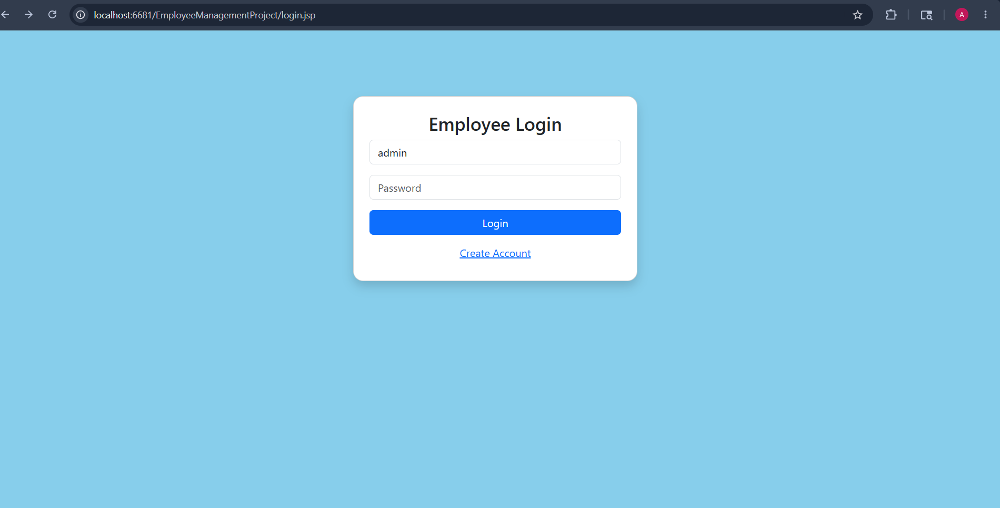
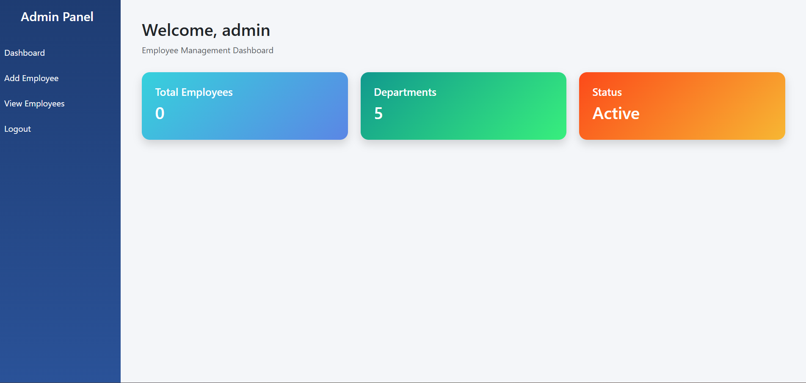
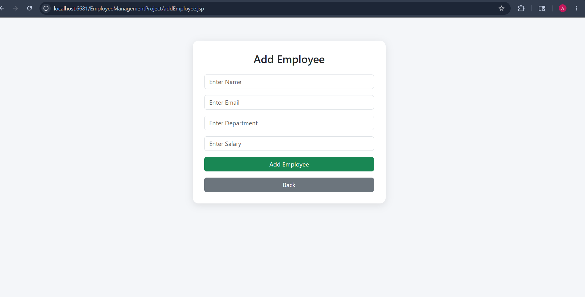
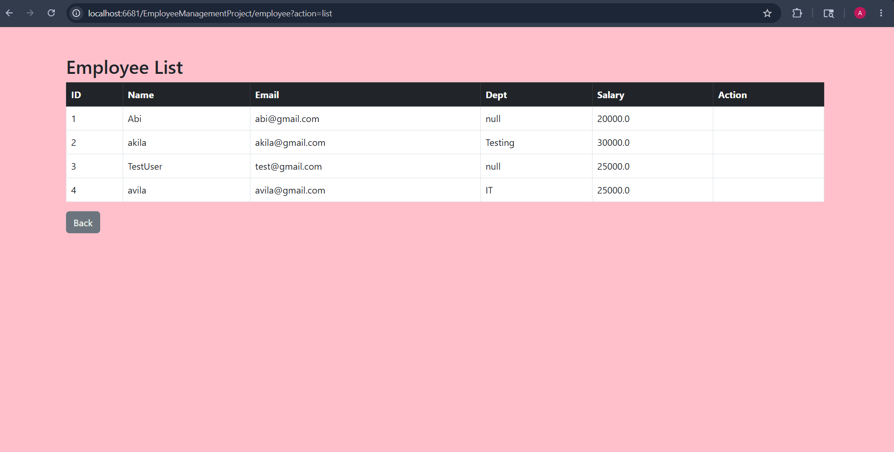
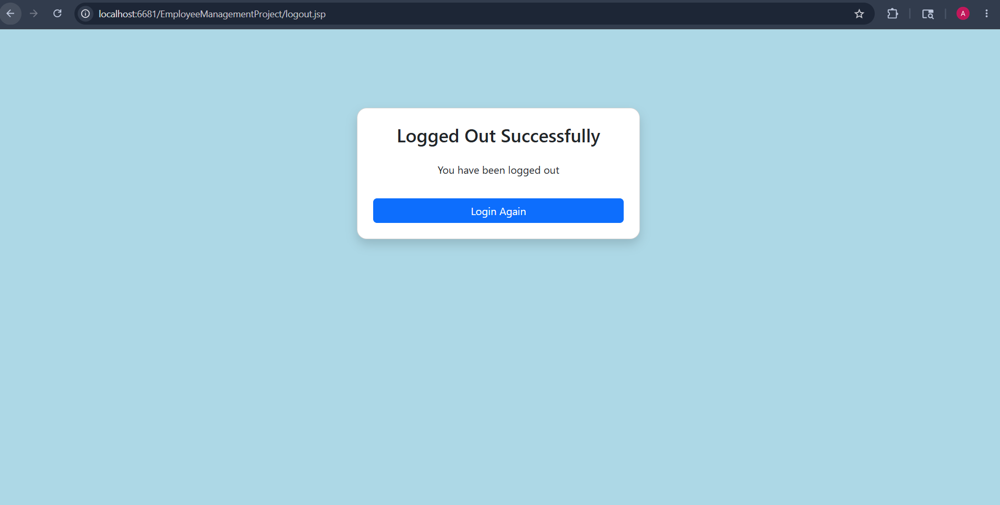

# Employee Management System

## Features

* Add Employee
* View Employee
* Update Employee
* Delete Employee

## Technologies Used

* Java
* JSP & Servlets
* JDBC
* MySQL
* Apache Tomcat

## How to Run

1. Import project into Eclipse
2. Configure Tomcat server
3. Run on server

## Screenshots
### Register Employees

### Login Employees

### Home Page

### Add Employee

### View Employees

### Logout Employees

